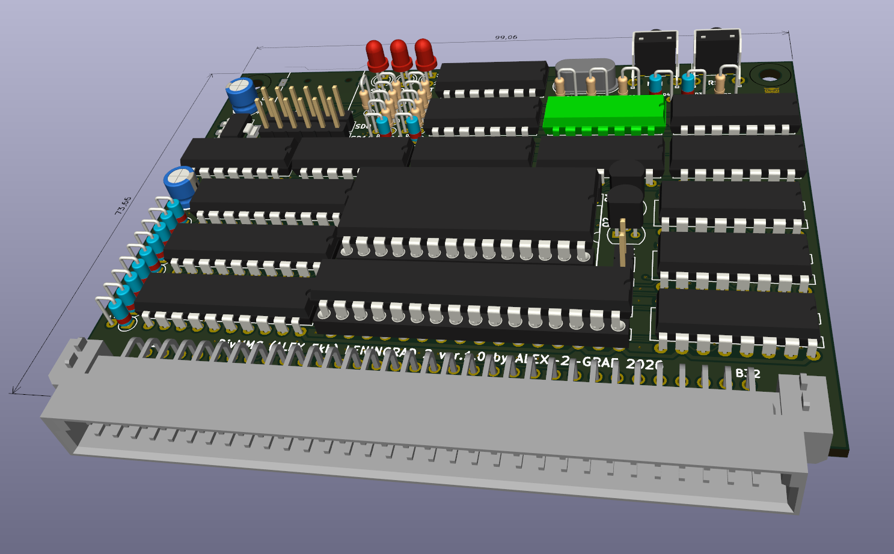
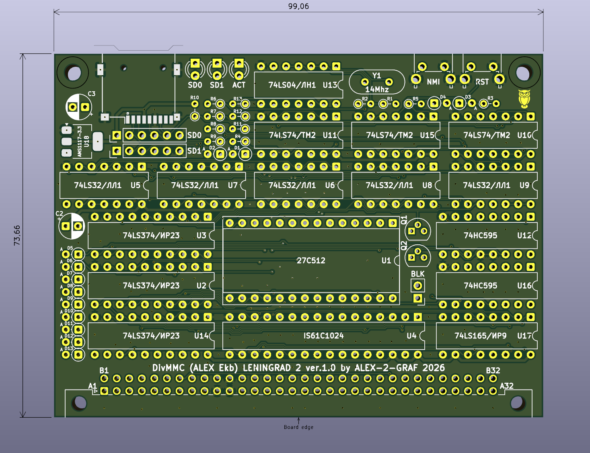
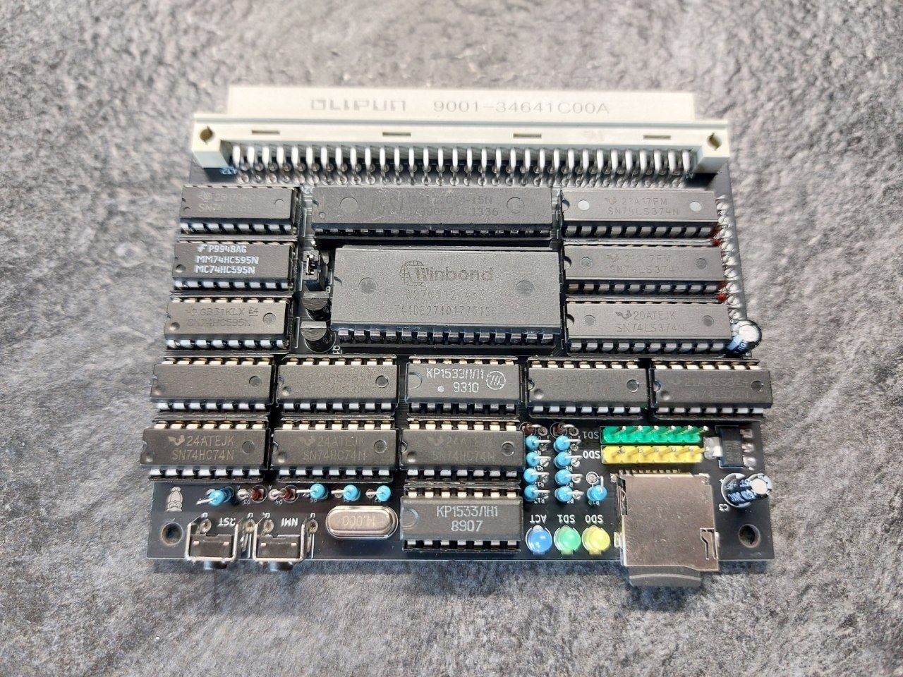

# Leningrad2-DivMMC
  
DivMMC controller for ZX Spectrum computers.
  
## Описание
  
&#x20;   Интерфейс DivMMC для легендарного клона Leningrad-2. Позволяет использовать современные SD-карты в качестве накопителя. Работает под управлением операционной системы ESXDOS, обеспечивая мгновенную загрузку игр (TAP, TRD, Z80, SNA) и поддержку длинных имен файлов.
&#x20; 
&#x20;   Проект основан на проверенной схемотехнике от [AlexEkb](https://github.com/AlexEkb4ever) и реализован на доступной мелкой логике.
  
## Историческая справка и контекст
  
&#x20;   Если BDI (TR-DOS) — это классика 90-х, то DivMMC — это стандарт сегодняшнего дня. Данный контроллер адаптирован специально для моих версий плат [Leningrad-2-48k](https://github.com/Alex-2-Graf/LENINGRAD-2-48k) и [Leningrad-2-128k-SRAM](https://github.com/Alex-2-Graf/Leningrad-2-128k-SRAM), где системная шина уже подготовлена. Однако его можно подключить и к любому другому «Ленинграду-2» при минимальных доработках шины.
  
## Технические особенности
  
Основные возможности
  
* Носитель: Поддержка двух SD-карт (MicroSD + разъем для подключения второго модуля).
* Логика: Собрано на дискретной логике (без использования ПЛИС/CPLD), что упрощает сборку и отладку.
* Управление: На плате установлены кнопки NMI (вызов меню навигатора ESXDOS) и RESET.
* ОС: Полная совместимость с ESXDOS (версии 0.8.9 и выше)(загрузка файлов .TAP, .TRD, .SCL, .Z80).
  
  
[iBOM](Schematics/DivMMC\_L2.html) [Схема](Schematics/DivMMC\_L2.pdf) [Gerber](Gerber/DivMMC\_L2\_Gerber.zip)
  

  

  

  
## Подключение
  
&#x20;   Контроллер подключается к системному разъему. Все необходимые сигналы управления (MREQ, IORQ, M1, RD, WR) и шина данных/адреса задействованы согласно спецификации DivMMC.

&#x20;   Важно: Для корректной работы требуется наличие сигнала M1. На моих версиях плат он выведен штатно.
  
## Программное обеспечение и ROM
  
Для работы контроллера требуется прошитая микросхема ПЗУ с операционной системой esxDOS.
  
&#x20;   Важно: В данном проекте используется модифицированная версия прошивки, адаптированная под схемотехнику AlexEkb и особенности шины «Ленинград-2». Необходимый файл прошивки находится в папке /Firmware. [тут](Firmware/ROM.bin)
  
&#x20;   Официальный сайт проекта esxDOS: esxdos.org (для ознакомления с командами и структурой системных папок на SD-карте).
  
&#x20;   Карту SD отформатировать в FAT32 и распаковать на неё [архив](Firmware/esxdos\_disk.zip)

